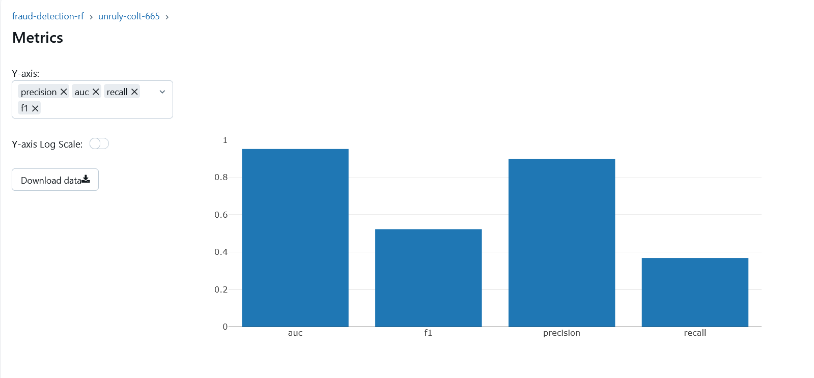
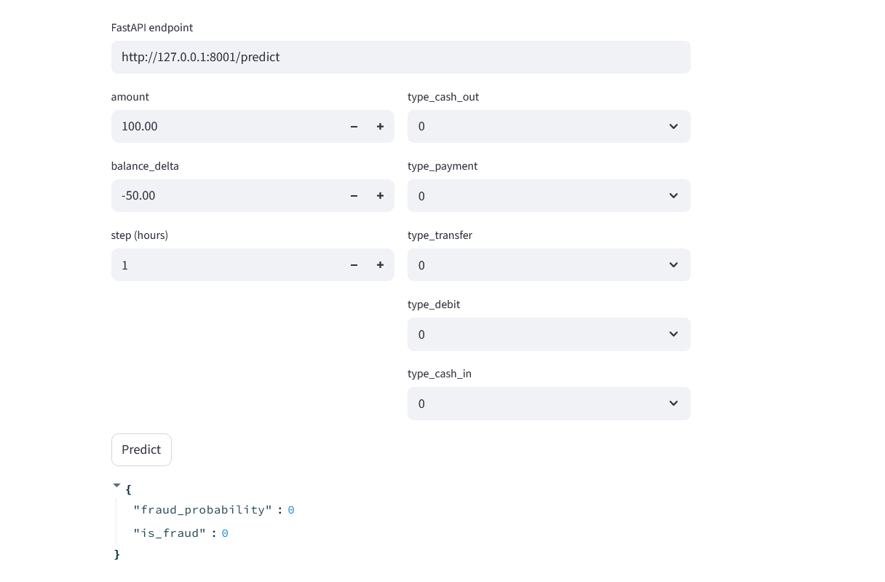

# MLOps Fraud Detection (End-to-End)

This repository is a **production-style scaffold** for a fraud detection project using the `PS_20174392719_1491204439457_log.csv` dataset.

It includes:
- 📓 **Jupyter** for EDA
- 🧪 **MLflow** for experiment tracking + model registry
- 🧀 **Feast** for a local feature store (Redis online, file offline)
- 🧱 **Kubeflow Pipelines** for orchestration (KFP SDK)
- 🚀 Deployment via **FastAPI** (API) + **Streamlit** (UI)
- 📦 **BentoML** for model-as-a-service packaging & deployment
- 📊 **Evidently** for **data drift monitoring**, including a KFP component
- 🐳 **Docker** + **Docker Compose**
- 🤖 **GitHub Actions** for CI/CD

> The stack is modular—use only what you need. You can run locally with Conda or fully containerized.

---

## 1) Repository structure

```
mlops-fraud-detection/
├─ data/
│  ├─ raw/                                  # put PS_20174392719_1491204439457_log.csv here
│  └─ processed/
├─ feature_repo/                            # Feast repo
│  ├─ feature_store.yaml
│  ├─ features.py
│  └─ README.md
├─ notebooks/
│  └─ 01_eda.ipynb                          # (create in Jupyter)
├─ src/
│  ├─ fraud/
│  │  ├─ data_ingest.py
│  │  ├─ features.py
│  │  ├─ train.py
│  │  ├─ evaluate.py
│  │  └─ utils.py
│  ├─ monitoring/
│  │  └─ evidently_drift.py
│  ├─ pipelines/
│  │  └─ kfp_pipeline.py
│  ├─ serving/
│  │  └─ fastapi_app.py
│  └─ ui/
│     └─ streamlit_app.py
├─ docker/
│  ├─ Dockerfile.api
│  ├─ Dockerfile.train
│  └─ Dockerfile.streamlit
├─ .github/workflows/
│  └─ ci-cd.yml
├─ .env.example
├─ compose.yaml
├─ environment.yml
├─ requirements.txt
├─ Makefile
├─ pyproject.toml
└─ README.md
```

---

## 2) Quickstart

### 2.1 Clone & set up environment
```bash
git clone <your-fork-url> mlops-fraud-detection
cd mlops-fraud-detection

# Conda env
conda env create -f environment.yml
conda activate mlops-fraud

# OR: pip
python -m venv .venv && source .venv/bin/activate
pip install -r requirements.txt
```

### 2.2 Bring up infra (MinIO S3 + MLflow Tracking + Redis for Feast)
```bash
cp .env.example .env
# (edit credentials if needed)

docker compose up -d
# MLflow UI -> http://localhost:5001
# MinIO UI  -> http://localhost:9001 (admin/minio123 by default)
# Redis     -> localhost:6379
```

### 2.3 Put the dataset
Download `PS_20174392719_1491204439457_log.csv` and place it under `data/raw/`.

### 2.4 EDA
Launch Jupyter:
```bash
jupyter lab
```
Create `notebooks/01_eda.ipynb` and explore columns:
- `step`, `type`, `amount`, `nameOrig`, `oldbalanceOrg`, `newbalanceOrig`, `nameDest`, `oldbalanceDest`, `newbalanceDest`, `isFraud`

### 2.5 Train & log to MLflow
```bash
export $(cat .env | xargs)  # load env vars on Mac/Linux
python -m src.fraud.train --data data/raw/PS_20174392719_1491204439457_log.csv
```

This will:
- preprocess & engineer features
- split train/valid
- train an XGBoost classifier
- log metrics/params/artifacts to MLflow
- register the model in MLflow Model Registry




### 2.6 Feast (Feature store)
Generate features and apply Feast registry:
```bash
python -m src.fraud.features --to_parquet data/processed/features.parquet

feast -c feature_repo apply
feast -c feature_repo materialize-incremental $(date -u +"%Y-%m-%dT%H:%M:%S")
```

### 2.7 Serve the model (FastAPI) + Streamlit UI
```bash
# API
uvicorn src.serving.fastapi_app:app --host 0.0.0.0 --port 8000 --reload

# UI (in another terminal)
streamlit run src/ui/streamlit_app.py
```


### 2.8 BentoML (optional service packaging)
```bash
bentoml build
bentoml serve --port 3000 fraud_bento:latest
```

### 2.9 Kubeflow Pipelines (local compile & submit via KFP)
> Requires a running Kubeflow cluster (e.g., Minikube + Kubeflow). Once KFP is reachable:
```bash
python -m src.pipelines.kfp_pipeline --compile pipeline.yaml
# then upload pipeline.yaml in KFP UI, or
python -m src.pipelines.kfp_pipeline --submit
```

### 2.10 Data Drift Monitoring (Evidently)
```bash
python -m src.monitoring.evidently_drift --ref data/processed/train.parquet --cur data/processed/current.parquet --out reports/drift.html
```

---

## 3) CI/CD (GitHub Actions)
On each push:
- Lint & tests
- Build Docker images (API/UI) and push to registry (if secrets provided)
- (Optional) Trigger deployment jobs

See: `.github/workflows/ci-cd.yml`

---

## 4) Environment Variables

Copy `.env.example` -> `.env` and adjust:
- `MLFLOW_TRACKING_URI=http://localhost:5001`
- `MLFLOW_S3_ENDPOINT_URL=http://localhost:9000` (MinIO S3 endpoint)
- `AWS_ACCESS_KEY_ID=admin`
- `AWS_SECRET_ACCESS_KEY=minio123`
- `MLFLOW_ARTIFACTS_BUCKET=mlflow`

---

## 5) Notes
- This scaffold balances simplicity and production concerns. You can swap components (e.g., Postgres for MLflow backend, S3 for artifacts, external Redis, etc.).
- For Kubeflow, ensure you have KFP SDK access to your cluster and a proper service account configured.
